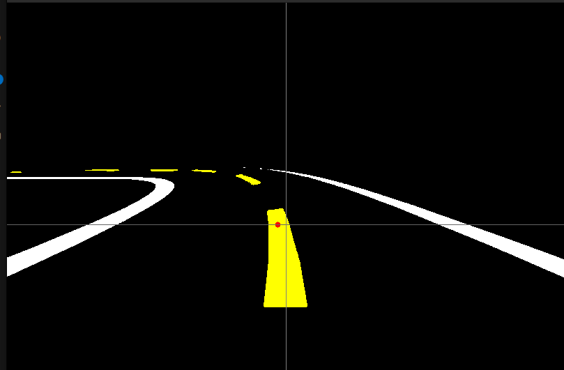

# Carla client

## Index:

- [Connection with server](#connection-with-server)
- [Deepracer Camera settings](#deepracer-camera-settings)
- [Client time vs real time](#client-time-vs-real-time)
- [HSV Filter and mask segmentation](#hsv-filter-and-mask-segmentation)
- [Generate Dataset](#generate-dataset)

---

<video width="1280" height="720" controls>
  <source src="../images/manualcontrol.mp4" type="video/mp4">
</video>
(Map modified as the ramp has been added)

## Connection with server

Once the package is compressed at the carla root folder:

```bash
make package
```
Execute 
```
CarlaUE4.sh
```
located at :

```
/Dist/CARLA_Shipping_0.9.15.2-2-gb23c01ae4-dirty/LinuxNoEditor
```
Now the server will be available to be connected to. Note that it can be launched with the flag ---RenderOffscreen to make it handier to use later.


Then for the client, you have to create a python file (.py). 

We are going to use manualcontrol.py as an example, that will allow us to control the deepracer in the world we have just spawned. We will be using the keys W A S D as input:
-      w: Move forward
-      A: Turn left
-      S: Brake
-      D: Turn right


First, you must import the required modules:

```python
import carla
import time
import pygame
import numpy as np
```
- carla: CARLA client API

- time: for sleep/wait operations

- pygame: for keyboard input and display

- numpy: to process camera image data


Configuration for the CARLA server and the vehicle blueprint.


```python
HOST = '127.0.0.1'
PORT = 2000
VEHICLE_MODEL = 'vehicle.finaldeepracer.aws_deepracer'
```

Initialize Pygame for displaying the RGB camera feed.

```python
pygame.init()
WIDTH, HEIGHT = 800, 600
screen = pygame.display.set_mode((WIDTH, HEIGHT))
pygame.display.set_caption("DeepRacer")

```
Connect to CARLA, set timeout, and load a specific map (Town01).


```python
client = carla.Client(HOST, PORT)
client.set_timeout(5.0)
world = client.get_world()
client.load_world('Town01') 

```
Set sunny weather with clouds but no rain or fog.

```python
weather = carla.WeatherParameters(
    cloudiness=80.0,
    precipitation=0.0,
    sun_altitude_angle=90.0,
    fog_density=0.0,
    wetness=0.0
)
world.set_weather(weather)
```

Spawn the DeepRacer Vehicle. Get the blueprint for the AWS DeepRacer vehicle.

```python
blueprint_library = world.get_blueprint_library()
vehicle_bp = blueprint_library.find(VEHICLE_MODEL)
```
Set vehicle spawn location and attempt to spawn it. If it fails, the program exits.

```python
spawn_point = carla.Transform(carla.Location(x=2.95, y=-3.7, z=0.6),
                carla.Rotation(pitch=0, yaw=-90, roll=0))
vehicle = world.try_spawn_actor(vehicle_bp, spawn_point)
```

Attach an RGB Camera to the Vehicle.Configure the RGB camera sensor with resolution and field of view.


```python
camera_rgb_bp = blueprint_library.find('sensor.camera.rgb')
camera_rgb_bp.set_attribute('image_size_x', str(WIDTH))
camera_rgb_bp.set_attribute('image_size_y', str(HEIGHT))
camera_rgb_bp.set_attribute('fov', '90')
```
Place and attach the camera to the vehicle.

```python
camera_rgb_transform = carla.Transform(carla.Location(x=-1, z=0.5))
camera_rgb = world.spawn_actor(camera_rgb_bp, camera_rgb_transform, attach_to=vehicle)
```

Process RGB Image from Camera.
Convert raw image data into a Pygame surface for display.

```python
def process_rgb(image):
    global camera_image_rgb
    array = np.frombuffer(image.raw_data, dtype=np.uint8)
    array = np.reshape(array, (image.height, image.width, 4))[:, :, :3]
    array = array[:, :, ::-1]
    camera_image_rgb = pygame.surfarray.make_surface(array.swapaxes(0, 1))
```

Start listening to camera stream and process frames in real time:

```python
camera_rgb.listen(lambda image: process_rgb(image))

```

Start the control loop and poll the keyboard.

```python
control = carla.VehicleControl()
running = True

while running:
    keys = pygame.key.get_pressed()
    if keys[pygame.K_w]: ...
    if keys[pygame.K_a]: ...
    if keys[pygame.K_d]: ...
    if keys[pygame.K_s]: ...
    control.hand_brake = keys[pygame.K_SPACE]
```
Apply control values to the vehicle.

```python
vehicle.apply_control(control)
```

Event Handling and Display

```python
for event in pygame.event.get():
        if event.type == pygame.QUIT or (event.type == pygame.KEYDOWN and event.key == pygame.K_ESCAPE):
            running = False

    
    if camera_image_rgb:
        screen.blit(camera_image_rgb, (0, 0))

    pygame.display.flip()
```

--- 

Here is the **FULL CODE**: 

```python
import carla
import time
import pygame
import numpy as np

HOST = '127.0.0.1'
PORT = 2000
VEHICLE_MODEL = 'vehicle.finaldeepracer.aws_deepracer'

pygame.init()
WIDTH, HEIGHT = 800, 600
screen = pygame.display.set_mode((WIDTH, HEIGHT))
pygame.display.set_caption("DeepRacer")


client = carla.Client(HOST, PORT)
client.set_timeout(5.0)
world = client.get_world()
client.load_world('Town01') 


weather = carla.WeatherParameters(
    cloudiness=80.0,
    precipitation=0.0,
    sun_altitude_angle=90.0,
    fog_density=0.0,
    wetness=0.0
)
world.set_weather(weather)

blueprint_library = world.get_blueprint_library()
vehicle_bp = blueprint_library.find(VEHICLE_MODEL)


spawn_point = carla.Transform(carla.Location(x=2.95, y=-3.7, z=0.6),
                carla.Rotation(pitch=0, yaw=-90, roll=0))

vehicle = world.try_spawn_actor(vehicle_bp, spawn_point)
if not vehicle:
    print("unable to spanw")
    exit()
print(f"vehicle {VEHICLE_MODEL} spaned at {spawn_point.location}")

camera_rgb_bp = blueprint_library.find('sensor.camera.rgb')
camera_rgb_bp.set_attribute('image_size_x', str(WIDTH))
camera_rgb_bp.set_attribute('image_size_y', str(HEIGHT))
camera_rgb_bp.set_attribute('fov', '90')


camera_rgb_transform = carla.Transform(carla.Location(x=-1, z=0.5))
camera_rgb = world.spawn_actor(camera_rgb_bp, camera_rgb_transform, attach_to=vehicle)


camera_image_rgb = None


def process_rgb(image):
    global camera_image_rgb
    array = np.frombuffer(image.raw_data, dtype=np.uint8)
    array = np.reshape(array, (image.height, image.width, 4))[:, :, :3]
    array = array[:, :, ::-1]
    camera_image_rgb = pygame.surfarray.make_surface(array.swapaxes(0, 1))


camera_rgb.listen(lambda image: process_rgb(image))

control = carla.VehicleControl()
running = True

while running:
    keys = pygame.key.get_pressed()

    if keys[pygame.K_w]:
        control.throttle = min(control.throttle + 0.01, 0.8)

    else:
        control.throttle = 0.0

        
    control.brake = min(control.brake + 0.1, 1.0) if keys[pygame.K_s] else 0.0

    if keys[pygame.K_a]:
        control.steer = max(control.steer - 0.05, -1.0)

    elif keys[pygame.K_d]:
        control.steer = min(control.steer + 0.05, 1.0)

    else:
        control.steer = 0.0

    control.hand_brake = keys[pygame.K_SPACE]

    vehicle.apply_control(control)

    for event in pygame.event.get():
        if event.type == pygame.QUIT or (event.type == pygame.KEYDOWN and event.key == pygame.K_ESCAPE):
            running = False

    
    if camera_image_rgb:
        screen.blit(camera_image_rgb, (0, 0))

    pygame.display.flip()
    

camera_rgb.destroy()
vehicle.destroy()
pygame.quit()

```

Now execute the code:

```bash
python3 manualcontrol.py
```

---

## Deepracer Camera Settings


To replicate the same camera settings as the actual Deepracer (using the front POV camera). We will need these settings. They represent the location of the camera and its pitch, as it is a bit tilted and facing down.

```python
camera_rgb_bp = blueprint_library.find('sensor.camera.rgb')
camera_rgb_bp.set_attribute('image_size_x', str(WIDTH))
camera_rgb_bp.set_attribute('image_size_y', str(HEIGHT))
camera_rgb_bp.set_attribute('fov', '120')


transform_front = carla.Transform(carla.Location(x=0.13, z=0.13), carla.Rotation(pitch=-30))
camera_front = world.spawn_actor(camera_rgb_bp, transform_front, attach_to=vehicle)
```

## Client time vs real time

When using **synchronous mode** in CARLA, it is **essential to run the simulator with a fixed time-step**.  
Otherwise, the physics engine will try to "catch up" for the time the client spent idle, leading to **unrealistic or inconsistent physics**.

What is Fixed Time-Step?

In fixed time-step mode, the simulation advances by the same time increment on every `world.tick()` call, regardless of how fast your computer is.  
To enable this, we must set:

```python
settings.synchronous_mode = True
settings.fixed_delta_seconds = 1.0 / 20.0  # 20 FPS
world.apply_settings(settings)
```

We want to observe the difference between:

The real time it takes for the computer to perform one simulation step (world.tick()), and

The callback frequency of the camera sensor (e.g. every time it sends an image frame).

We define a camera_callback() function that prints the frame number and timestamp:

```python
def camera_callback(image):
    print(f"[Frame {image.frame}] timestamp: {image.timestamp:.5f}")

```
Inside the main loop, we also measure and print the real time gap between ticks:

```python
while running:
    t1 = time.time()
    world.tick()
    t2 = time.time()
    print(f"real time gap: {t2 - t1}")
```

We get this output:

```bash
real time gap: 0.0028502941131591797
real time gap: 0.0028717517852783203
[Frame 11578] timestamp: 162.86267
real time gap: 0.002864837646484375
[Frame 11579] timestamp: 162.91267
[Frame 11580] timestamp: 162.96267
real time gap: 0.0028464794158935547
[Frame 11581] timestamp: 163.01267
real time gap: 0.002921581268310547
real time gap: 0.0028870105743408203
[Frame 11582] timestamp: 163.06267
[Frame 11583] timestamp: 163.11267
real time gap: 0.0028617382049560547
[Frame 11584] timestamp: 163.16267
real time gap: 0.0031239986419677734
real time gap: 0.0028901100158691406
[Frame 11585] timestamp: 163.21267
[Frame 11586] timestamp: 163.26267
real time gap: 0.0029799938201904297

```

**Interpretation**

Real time gap: 0.0028 means that world.tick() is being executed quickly (~2.8 ms per step) (the computer is fast).

The camera callback prints roughly every 0.05 seconds, confirming it operates at the expected 20 FPS (1 / 20 = 0.05s).

This demonstrates that:

The simulation time advances deterministically by 0.05s per tick.

The real time your PC takes to simulate one frame can be much less than 0.05s.

This difference is expected and is the advantage of running the simulator as fast as possible while maintaining consistent simulation timing.


Here is the code to try this out: 

```python3
import carla
import time
import pygame
import numpy as np
import matplotlib.pyplot as plt

HOST = '127.0.0.1'
PORT = 2000
VEHICLE_MODEL = 'vehicle.finaldeepracer.aws_deepracer'


pygame.init()
WIDTH, HEIGHT = 800, 600
screen = pygame.display.set_mode((WIDTH, HEIGHT))
pygame.display.set_caption("DeepRacer - RGB y Segmentación Semántica")


client = carla.Client(HOST, PORT)
client.set_timeout(5.0)
world = client.get_world()

#FPS
settings = world.get_settings()
settings.synchronous_mode = True
settings.fixed_delta_seconds = 1.0 / 20.0
world.apply_settings(settings)

weather = carla.WeatherParameters(
    cloudiness=80.0,
    precipitation=0.0,
    sun_altitude_angle=90.0,
    fog_density=0.0,
    wetness=0.0
)
world.set_weather(weather)

blueprint_library = world.get_blueprint_library()
vehicle_bp = blueprint_library.find(VEHICLE_MODEL)


spawn_point = carla.Transform(
    carla.Location(x=3, y=-1, z=0.5),
    carla.Rotation(yaw=-90)
)
vehicle = world.try_spawn_actor(vehicle_bp, spawn_point)
if not vehicle:
    print("Error spawning")
    exit()


camera_rgb_bp = blueprint_library.find('sensor.camera.rgb')
camera_rgb_bp.set_attribute('image_size_x', str(WIDTH))
camera_rgb_bp.set_attribute('image_size_y', str(HEIGHT))
camera_rgb_bp.set_attribute('fov', '120')


transform_front = carla.Transform(carla.Location(x=0.13, z=0.13), carla.Rotation(pitch=-30))
transform_thirdpers = carla.Transform(carla.Location(x=-1, z=0.75))
camera_front = world.spawn_actor(camera_rgb_bp, transform_front, attach_to=vehicle)


def camera_callback(image):
    print(f"[Frame {image.frame}] timestamp: {image.timestamp:.5f}")


camera_front.listen(camera_callback)


control = carla.VehicleControl()
running = True

while running:

    # Move on to the next iteration with world.tick()
    t1 = time.time()
    world.tick()
    t2 = time.time()
    print(f"real time gap: {t2-t1}")


camera_rgb.destroy()
vehicle.destroy()
pygame.quit()
```

## HSV Filter and mask segmentation



This section explains how the script processes RGB images from the front camera of the Deepracer in CARLA to create **semantic segmentation masks** based on color, using the HSV color space.
We want to:
- Detect **white** and **yellow** lane markings on the road.
- Classify each pixel into a semantic class:
  - `0`: background (black)
  - `1`: white
  - `2`: yellow
- Save a colorized mask and use it for training or control logic.

```python
hsv = cv2.cvtColor(rgb, cv2.COLOR_RGB2HSV)
```

The image is converted from RGB to HSV. HSV is preferred for color segmentation because this makes it easier to separate colors like white and yellow.


### Create Color Masks:

**Yellow Mask**
```python
lower_yellow = np.array([18, 50, 150])
upper_yellow = np.array([40, 255, 255])
mask_yellow = cv2.inRange(hsv, lower_yellow, upper_yellow)
```

**White Mask**

```python
lower_white = np.array([0, 0, 200])
upper_white = np.array([180, 30, 255])
mask_white = cv2.inRange(hsv, lower_white, upper_white)
```

**Create Semantic Class Mask**

Initialize a blank mask.

Pixels detected as white are labeled as 1.

Pixels detected as yellow are labeled as 2.

```python
mask_class = np.zeros_like(mask_white, dtype=np.uint8)
mask_class[mask_white > 0] = 1
mask_class[mask_yellow > 0] = 2
```

### Convert Class Mask to RGB for Visualization

```python
mask_rgb = np.zeros_like(rgb)
mask_rgb[mask_class == 1] = [255, 255, 255]  # white
mask_rgb[mask_class == 2] = [255, 255, 0]    # yellow

```

This gives a visually interpretable image where:

White areas are actual white ([255,255,255])

Yellow areas are yellow ([255,255,0])

Background remains black ([0,0,0])

This mask_rgb is used for display (cv2.imshow) and for dataset generation (cv2.imwrite).


---

## Generate Dataset


To do so, we launch a script that creates a unique dataset folder based on the current timestamp:

```python
currtime = str(int(time.time() * 1000))
DATASET_ID = "Deepracer_BaseMap_" + currtime
```

```pgsql
dataset/
└── Deepracer_BaseMap_<timestamp>/
    ├── rgb/        ← RGB images from the camera
    ├── masks/      ← Mask images with segmented classes
    └── dataset.csv ← Metadata log
```

Each frame is processed and saved using the keep_data() function. 

- rgb_img is saved as-is.

- mask_class_img is a colorized version of the class mask:

    - Pixels labeled 1 (white) become [255, 255, 255]

    - Pixels labeled 2 (yellow) become [255, 255, 0]

    - Background stays black

```python
RGB_DIR = os.path.join(DATASET_ID, "rgb")
MASK_DIR = os.path.join(DATASET_ID, "masks")
CSV_PATH = os.path.join(DATASET_ID, f"dataset.csv")

def keep_data(timestamp, rgb_img, mask_class_img, accel, steer, brake, speed, heading):
    ...
    cv2.imwrite(os.path.join(RGB_DIR, rgb_name), rgb_img)
    cv2.imwrite(os.path.join(MASK_DIR, mask_name), cv2.cvtColor(mask_class_img, cv2.COLOR_RGB2BGR))

```
Each image is associated with a row in the CSV file:

```python
writer.writerow([rgb_path_rel, mask_path_rel, timestamp, accel, steer, brake, speed, heading])

```
- rgb_path	Relative path to the RGB image
- mask_path	Relative path to the mask image
- timestamp	Capture time in ms
- throttle	Throttle value at capture
- steer	Steer value at capture
- brake	Brake value at capture
- speed	Vehicle speed in m/s
- heading	Heading angle in degrees


### Using a Mutex (Lock) for Safe Image Access

This script uses a **Python mutex (`Lock`)** to ensure safe access to the camera image data, especially in a **multithreaded context** involving sensor callbacks from CARLA.

### Why Use a Mutex?

CARLA sensors (like the RGB camera) call a **callback function in a separate thread** every time a new image arrives.  
Meanwhile, the main loop (running in another thread) may try to access that image.

Without protection, this leads to **race conditions** where:
- Data may be read while it's being written
- The program may crash or behave inconsistently
- You may process outdated or corrupted frames


### Lock Setup

```python
from threading import Lock
from collections import deque

image_queue = deque(maxlen=1)
queue_lock = Lock()
```

- image_queue: stores only the latest image
- queue_lock: a mutex to synchronize access to the queue


Every time a new image is received, the mutex is acquired with with queue_lock
The queue is cleared (to keep only the latest image)
The new image is appended safely.

```python
def camera_callback(image):
    with queue_lock:
        image_queue.clear()
        image_queue.append((int(time.time() * 1000), image))
```

### Safe Access in the Main Loop

The main loop locks the queue before accessing it
If the image is too old (over 150 ms), it is discarded
This avoids race conditions with the callback

```python
with queue_lock:
    if image_queue:
        img_timestamp, image = image_queue[0]
        age = int(time.time() * 1000) - img_timestamp
        if age <= MAX_IMAGE_AGE_MS:
            image = image_queue.popleft()[1]
        else:
            image = None  # Image too old, discard
    else:
        image = None

```