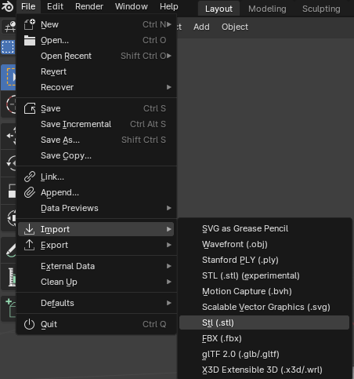
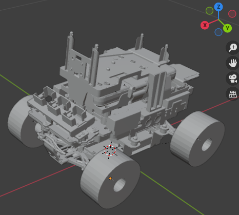
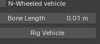

# How to create DeepRacer 3D Model

This video summarizes this webpage (Spanish dub):

<iframe width="560" height="315" 
src="https://www.youtube.com/embed/-P1rRYNXsuY" 
frameborder="0" allowfullscreen></iframe>

Get the Deepracer stl files

First of all you need to get the car files, which can be found in the git repository:

<a href="https://github.com/aws-deepracer/aws-deepracer" target="_blank" style="font-weight:bold; color:#007acc; text-decoration:none;">
  GitHub - aws-deepracer/aws-deepracer
</a>

To make it easier, here is the .stl file of the Deepracer chassis:

<a href="https://github.com/aws-deepracer/aws-deepracer/blob/main/deepracer_description/meshes/chassis.STL" target="_blank" style="font-weight:bold; color:#007acc; text-decoration:none;">
  Deepracer chassis
</a>

And here is the wheel .stl file:

<a href="https://github.com/aws-deepracer/aws-deepracer/blob/main/deepracer_description/meshes/right_front_wheel.STL" target="_blank" style="font-weight:bold; color:#007acc; text-decoration:none;">
  Deepracer wheel
</a>

Download both of them.

Install Blender add-on:

Go to this webpage and download the add-on:

<a href="
https://continuebreak.com/creations/ue4-vehicle-rigging-addon-blender/" target="_blank" style="font-weight:bold; color:#007acc; text-decoration:none;">
  Blender add-on
</a>

Now open Blender and go to Edit→Preferences. 

Then open de Add-ons section and click the Install button.

Search for the zip file you have just downloaded and click on Install Add-on from File.

Check if it is installed correctly by pressing N or by clicking on the tiny arrow located at the top right.:

Then a new window will pop up, you will find an Unreal Engine 4 Vehicle label:

If so, then the add-on will have been installed correctly.

Now import the chassis and wheels meshes. Just click on File→Import and select the type of file your meshes are (.stl).

Now, we are going to adjust chassis and wheels size to the actual size of the real life ones and then build up the car:

To do so, make sure you are using object mode:

(Top left of the screen).

If not, change it using tab key.

Click on the imported wheel and copy it other 3 times.

Now use the editor to transform, locate and rotate the wheels and chassis so that they are displayed together like in the above image. You can either use this editor to do so:

Or use the R key to rotate manually, the S key to scale it manually, or this icon on the left to move the object:

It is **really important** to face the X axis positively:

Once it is done, it is time to use the add-on we have just installed before.

Display the UE4 Vehicle label as mentioned before :

You have to fill those 5 void labels with the corresponding chassis and 4 wheels. You can either click on the gray  icon located on the right of each label and then manually click on each mesh or just click inside and select the corresponding mesh:  

(Do not worry about the mesh names now, you will have to change them later).

Now click on *Set Unit Scale*  at the bottom of the UE4 Vehicle display window:

Then click on *Rig Vehicle*:

You will see that bones have just appeared. Each one in a different mesh.

You can resize them in the bone length label. However resizing them does not affect the functionality, it is just for clearer visualization:

You will find your files in your collection, distributed in a similar way to this one:

 

Now it is the time to change some names, the only important ones are the bone ones and de vehicle base, they have to be named exactly the same as the names on the picture from above. If not, Unreal Engine will not recognize them in some further steps. Although bone names and vehicle base are the only important ones, I recommend using the same names that I am using for the rest of the meshes. Just double left click on each object or bone to change its name.

Once all of the above is done, this scenario must be exported into a .fbx file ( the kind of file Unreal Engine handles).

To do so, click on File→Export→FBX

Now, few things have to be done in this new window. Make sure to uncheck or select as in here:

So that only armature and mesh are exported, axes are correctly set, as so the geometry.

A new fbx file will be created.

---

This video explains the whole process (apart from other configurations that won’t be needed now) much better:

<iframe width="560" height="315" 
src="https://www.youtube.com/embed/laAs3lefrKY" 
frameborder="0" allowfullscreen></iframe>
