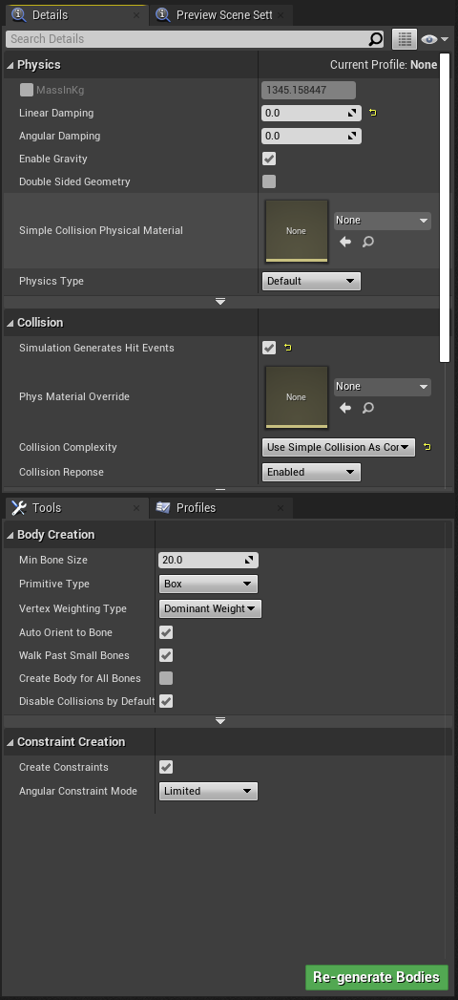
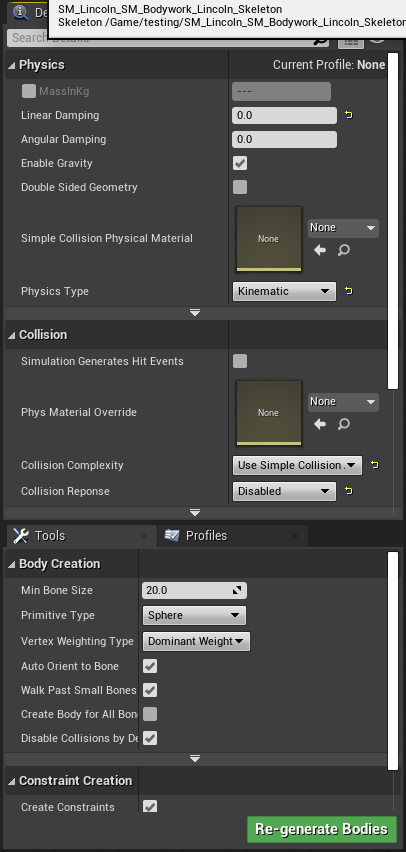
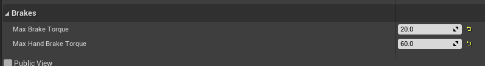
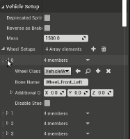
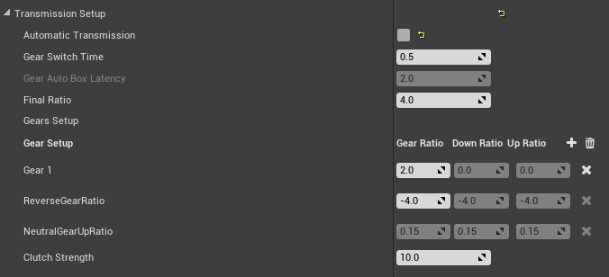
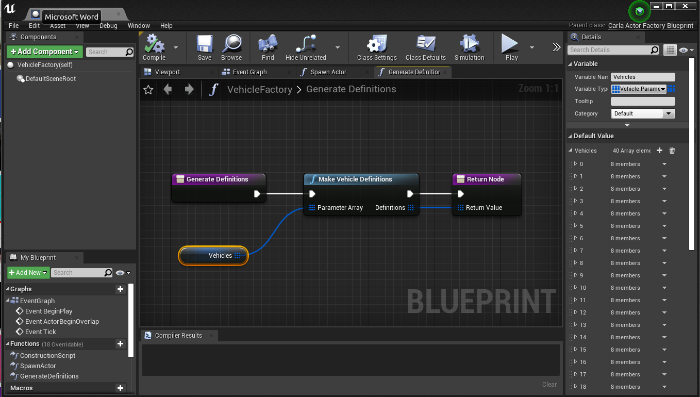
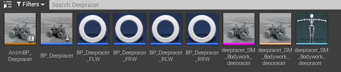

# How to Import the DeepRacer in CARLA


**Youtube videos**

These videos summarize this webpage. Part 1 summarizes how to import the Deepracer to Carla. Part 2 explains few settings to complete the implementation.

## English

Part 1:
<iframe width="560" height="315" 
src="https://www.youtube.com/embed/j3b0LqBg0lU" 
frameborder="0" allowfullscreen></iframe>

Part 2:
<iframe width="560" height="315" 
src="https://www.youtube.com/embed/1S2XwpWrW6A" 
frameborder="0" allowfullscreen></iframe>

## Español

Parte 1:
<iframe width="560" height="315" 
src="https://www.youtube.com/embed/5odEJVBtP20" 
frameborder="0" allowfullscreen></iframe>

Parte 2:
<iframe width="560" height="315" 
src="https://www.youtube.com/embed/xO_TxTSLdhU" 
frameborder="0" allowfullscreen></iframe>

## 中文

第1部分:
<iframe width="560" height="315" 
src="https://www.youtube.com/embed/svZVVhSl0ng" 
frameborder="0" allowfullscreen></iframe>

第2部分:
<iframe width="560" height="315" 
src="https://www.youtube.com/embed/OMnIWFAhVfA" 
frameborder="0" allowfullscreen></iframe>


**Importing into unreal engine**

First of all, find the deepracer.fbx file you just exported from blender or just take this model:

<a href="https://github.com/RoboticsLabURJC/2025-tfg-sergio-robledo/blob/main/3dmodels/blender/final_deepracer.fbx" target="_blank" style="font-weight:bold; color:#007acc; text-decoration:none;">
  Fbx model link
</a>


Now, run:

```bash
make launch
```

in the carla root directory.

Once Unreal Engine is open, navigate to:

**Carla→Static→Vehicles(or Cars/4Wheeled)**

Crate a new directory and name it: Deepracer. Navigate to this new directory  and click on the the green add/import button on the left. Click on Import to /Game/Carla/static….  Then select the .fbx file of the Deepracer.

We will be using default settings, so just click on import in the window that just appeared.

### Setting the physics asset

You will now have 3 files in your content browser directory, the 
mesh, the skeleton and the physics asset. Double click on the physics 
asset to open it.

Click on options on the Skeleton tree window. Click on show all.

First, select the Vehicle_Base. In the `Details` menu on the right, change the `Linear Damping` to 0.0 in the `Physics` section. Check `Simulation Generates Hit Events` in the `Collision` section and change the `Primitive Type` from `Capsule` to `Box` in the `Body Creation` section. Then press `Regenerate bodies`. The capsule will now change to a rectangular box. 



Then select all the wheels in the Skeleton Tree window(Options and select Show all bones) . Click each wheel bone while pressing  Ctrl key to select them all. Then change the Primitive type in the body creation window to sphere. Then generate bodies.

Make sure that 4 spheres have been created, one for each wheel.

For the wheels, change `Linear Damping` to 0.0, set `Physics Type` to `Kinematic`, and set `Collision Response` to `Disabled`. Press `Re-generate Bodies` once more.



Do not forget to save your changes: 


---

### Creating the animation

In the content browser directory where you have your new vehicle assets, right click and choose `Animation > Animation Blueprint`. In the popup that opens, search for `VehicleAnimInstance` in the `Parent Class` section and for the `Target Skeleton` search
 for the skeleton corresponding to the deepracer, you should be able  to see the name in your content browser. After selecting these two 
things press OK. This will create a new animation blueprint for your 
vehicle.

Rename it as `AnimBP_Deepracer`

To simplify things, we can copy the animation from another vehicle rather than building each block by ourselves.

 In a second content browser(Window→Content Browser→Content Bowser 2), open `Content > Carla > Static > Vehicles(or Cars) > 4Wheeled` and choose any vehicle(For example the Audia A2). 

Open the animation blueprint of your chosen vehicle and then copy all nodes that are not the `Output pose` node from this blueprint,

<video width="1280" height="720" controls>
  <source src="../images/36.mp4" type="video/mp4">
</video>

 to the new animation blueprint you have just crated in the Deepracer directory.(Ctrl+V in the Deepracer Animation Blueprint)

Connect the nodes by dragging a new connection between the final node and the output node. 

<video width="1280" height="720" controls>
  <source src="../images/37.mp4" type="video/mp4">
</video>

Press compile and the animation blueprint is now set. Do not forget to save it all.

---

### Creating the car blueprint

This blueprint will be the file Carla will be using when loading the car in Unreal.

Navigate with your content browser into `Content > Carla > Blueprints > Vehicles` and create a new directory, name it Deepracer.

Navigate with your content browser into `Content > Carla > Blueprints > Vehicles > AudiA2` or
 a similar vehicle. In here you will find a set of blueprints set up for
 the 4 wheels. Copy these into the directory containing your own vehicle(`Content > Carla > Blueprints > Vehicles > Deepracer`)   and rename them to ensure you can distinguish them later. Do it this way for each wheel: 

from BP_Lincoln_FLW to BP_Deepracer_FLW

from BP_Lincoln_FRW to BP_Deepracer_FRW

from BP_Lincoln_RLW to BP_Deepracer_RLW

from BP_Lincoln_RRW to BP_Deepracer_RRW

Open and change these settings on each of those four Blueprints:

- Change the mesh in Collision mesh (in Shape) to `Wheel_Shape`.
- Set shape radius to 3.75 and shape width to 4.0 (make sure to measure it in Blender) .The Z offset should be 0. Mass is 0.04 kg
- In the `Tire Config` section of the blueprint, use the `CommonTireConfig`.
- Compile and save the blueprint.
- `Affected by handbrake` should be checked for both rear wheels(in RLW and RRW Blueprints).`Steer angle` should be set to the maximum intended steer angle(30) for both front wheels and set to zero for both rear wheels.
- It is **REALLY IMPORTANT to make sure that CommonTireConfig tires  are used, before continuing to the next step, double check for each wheel blueprint that this tire is set. If not, and the tire is not defined, much later, Unreal will crash and shut down without an apparent reason. This is why!!!**

- For the suspension values, both front wheels must have these settings: 
  - Suspension force offset: 0.0
  - Suspension max raise: 0.1
  - Suspension max drop: 0.1
  - Suspension natural frecuency: 25.0
  - Suspension damping ratio: 1.0
- Both rear wheels must have these settings: 
  - Suspension force offset: 0.0
  - Suspension max raise: 1.5
  - Suspension max drop: 2.0
  - Suspension natural frecuency: 25.0
  - Suspension damping ratio: 1.0

---

[OPTIONAL]
To make the car even more realistic, change the brake torque and hand brake torque values on each wheel BP to these ones:  



--- 

Now right click in the content browser directory (where your deepracer wheels blueprints are) and chose `Blueprint Class`. Search in the `All Classes` menu for `BaseVehiclePawn` and choose this class. Name the blueprint as “BP_Deepracer” and open it. 

Select `Mesh` in the `Components` tab on the left and then click on the vehicle mesh(search for the deepracer mesh) into the Mesh section on the right hand side.

In `Anim Class` search for the animation corresponding to the deepracer that you set up in the previous step.

This next step is **REALLY IMPORTANT**, as it is not explained in any website tutorial and it is fundamental.

Type “center” in the Search Details browser and search for Center of Mass Offset. Change it to x=0.0, y=0.0 and z=-0.1, if not, the center mass will be below the ground and the car will be unable to move properly, as a massive “Force” will be pulling the Deepracer down. That z = -0.1 allows us to control the car much easier, as the center off mass is lowered a tiny bit and closer to the ground, the deepracer will be more stabilized. 

Next, select `Vehicle Movement` in the `Components` menu of the blueprint class and in the right `Details` menu navigate to the `Vehicle Setup` section. 

Change the vehicle mass to 1.23 kg.

Now in Wheel Setups, for each wheel class, find the wheel blueprint that you previously copied and renamed for the `Wheel Class` attribute.Make sure that each wheel class name corresponds to the bone name. For example :

In wheel setups, open 0, in Wheel Class, select BP_Deepracer_FLW as it corresponds to the bone named as Wheel_Front_Left.

Do the same for each wheel (1, 2 and 3 in Wheel Setups). 




Now search for Mechanical Setup->Transimssion Setup. Uncheck Automatic transmission, set gear switch time to 0.5, final ratio to 4.0. 
In the Gear Setup settings, delete all gears except for one: Gear 1 and set that Gear1 Gear Ratio to 2.0 and the ReverseGearRatio to -4.0. Clutch strength has to be 10. Compile and save.




Last step is setting up the link to this blueprint. 

Now navigate to `Content > Carla > Blueprints > Vehicles > VehicleFactory` and double click this to open the Vehicle Factory.

Select the `Vehicles` node and expand the `Vehicles` item in the `Default value` section on the right hand side.



Press the plus icon to add your new vehicle. Scroll down to the last entry and expand it, it should be empty. Name the make as  “Deepracer”and model as “AWS_Deepracer” .

In the class section find your blueprint class that you created in the previous step(BP_Deepracer).

 

Leave the number of wheels as 4 and put the generation as 0. Compile and save. 

Carla looks for this `VehicleFactory` file that has the “links” to all car configurations. What we are doing in here is adding a way for Carla to “know” that there is a vehicle called Deepracer and where its configurations are.

**Do a global save for safety and you are now ready to run your vehicle in a simulation. !!!**

Press play in the unreal toolbar to run the simulation:


Once it is running, to check if it worked. This script spawns the deepracer on x=0,y=0,z=0.5 ,lets you operate the vehicle using WASD keys:

<a href="https://github.com/RoboticsLabURJC/2025-tfg-sergio-robledo/blob/main/scripts/manualcontrol.py" target="_blank" style="font-weight:bold; color:#007acc; text-decoration:none;">
  Script Link
</a>


```bash
python3 manualcontrol.py
```

If anything went wrong, make sure that you followed every step correctly. 

If Unreal crashes, it means that there is something missing and Unreal cannot load something that does not even exist. Such as the tires configuration or wheel blueprints that are not correctly called from the car blueprint.

These are all files needed for this process (no need to be all in the same place):



Here is a video of the Deepracer once all these steps have been done:

<iframe width="560" height="315" 
src="https://www.youtube.com/embed/6da4URc5QoI" 
frameborder="0" allowfullscreen></iframe>
