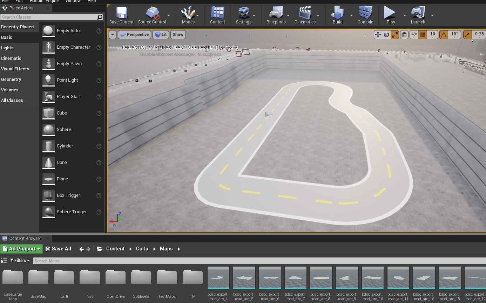

# How to manually include the Racetrack in any CARLA map

CARLA requires map geometry information in `.fbx` format and OpenDRIVE information in `.xodr` format.

There are several ways to import your map into CARLA. However, we will not need to create the whole map from scratch. We will be using an already made map and just adding the track mesh on top of its surface.

You will actually use an already created map with its own assets, objects and other configurations. And just add the meshes of the road we have just created. You can take this racetrack fbx:


<a href="https://github.com/RoboticsLabURJC/2025-tfg-sergio-robledo/blob/main/3dmodels/unreal/Package01/RaceTrack/RaceTrack.fbx" target="_blank" style="font-weight:bold; color:#007acc; text-decoration:none;">
  Fbx link
</a>


 Open Carla:

```bash
cd carla
make launch
```

In the *Content Browser* of the editor, navigate to `Content/Carla/Maps/BaseMap` and duplicate the map by right clicking on it and duplicating it, the, rename it to (.e.g)  RaceTrack.


Create a new folder with the name of your map package in the `Content/Carla/Maps` directory and save the duplicated map there.(e.g /RaceTrack).

In the *Content Browser* of the Unreal Engine editor, navigate to that folder you have just created. Right click in the grey area and select `Import to /Game/Carla/Maps...` under the heading *Import Asset*.


In the configuration window that pops up, make sure:

These options are unchecked:

- Auto Generate Collision
- Combine Meshes
- Force Front xAxis

In the following drop downs, the corresponding options are selected:

- Normal Import Method -Import Normals
- Material Import Method - Create New Materials

These options are checked:

- Convert Scene Unit
- Import Textures


If the Import textures box cannot be checked,  just with “Create New Materials” will be alright.

Click `Import`.

The racetrack meshes will appear in the *Content Browser*. Select the meshes and drag them into the scene. Before that, make sure you have an appropriate ground to display the racetrack on. You can drag into the scene any  static mesh that can work as a suitable ground.

Now it will look like this:


Scale and resize the meshes wherever you want using the Transform menu on the right sidebar:


Make sure to move the whole racetrack 0.01 up in Z axis so that it becomes visible.

Instead of BaseMap you can either choose other map and delete everything on it that is not really necessary such as trees, barriers, bushes, wires, signals… and then drag the racetrack inside



As the racetrack gray color can sometimes interfere if we would like to divide the image into masks and separate them into white and yellow. We can change the track material. 


Click on each track part while pressing ctrl in either the visualizer or the World outliner at the top right. 

You will be able to change the colors in the Details panel on the right, there you can see the three ones we are using. Element 0 representing the gray track, Element 1 the white borders and Element 2 the yellow middle line. Simply click on either label layout to change the color. To make it look black I have used an already existing material which is road_asphalt, the gray one which is imported once the track was imported, but you can create a new one manually and then select it in that same label. To create a new one, right click on the content browser and click on material.

To change the gray color in road_asphalt, double click on that material and then double click on the param square to select any color you like.


