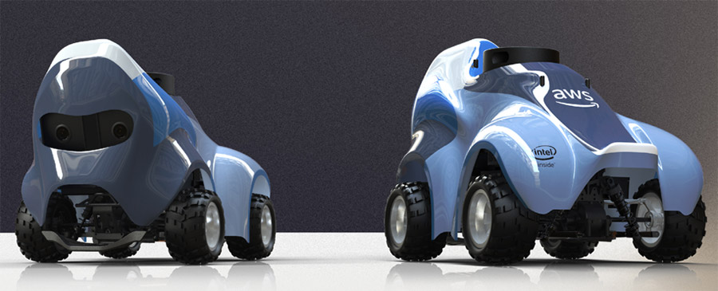
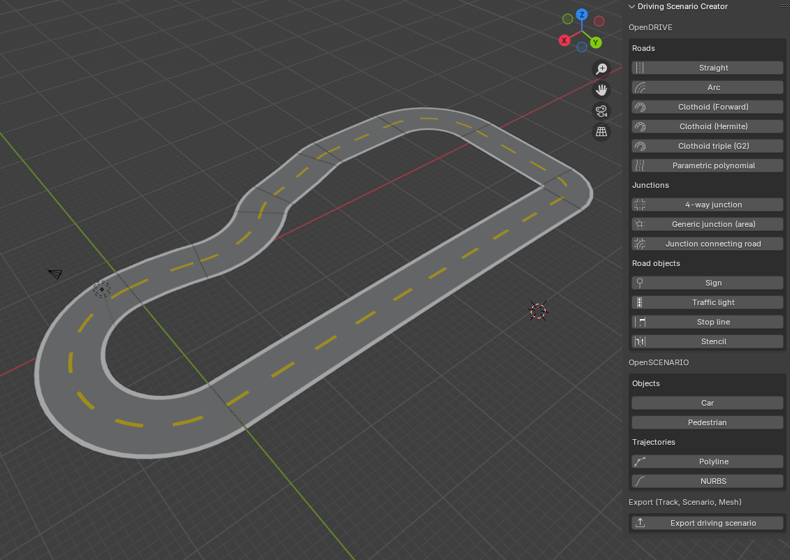
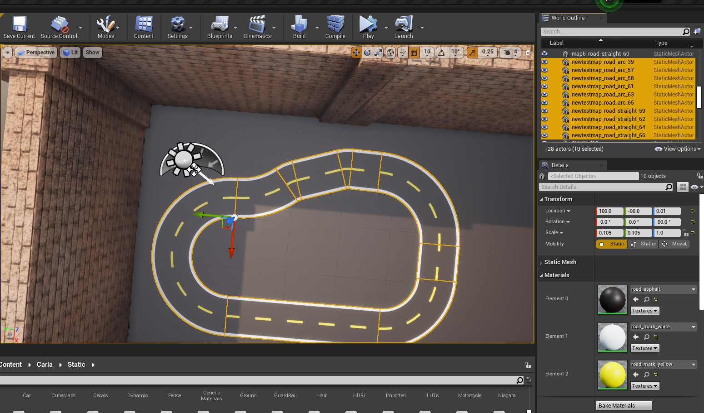

# Deepracer wiki

**Welcome to the Deepracer wiki!**

Here you will find step by step how to import and work with the AWS Deepracer in Carla Simulator.

### 📄 Documentation links:

Here are the links to the different steps.

How to create the **racetracks** and import them:

- [Racetrack Creation](racetrackcreation.md)

- [Include Racetrack in a CARLA Map](includeracetrackcarla.md)

How the **Deepracer** was modeled and how to import it:

- [Create DeepRacer](createdeepracerinblender.md)

- [Import Deepracer to Carla](importdeepracercarla.md)

<iframe width="560" height="315" 
src="https://www.youtube.com/embed/6da4URc5QoI" 
frameborder="0" allowfullscreen></iframe>

How to use the *Carla client* to connect to the server:

- [Client Usage](clientusage.md)

How to **connect** a **remote** to drive the Deepracer (for testing or dataset generation)

- [Remote control Deepracer](remotecontrol.md)

<video width="1280" height="720" controls>
  <source src="../images/Remote.mp4" type="video/mp4">
</video>

---

In case you need help with the Unreal Engine 4 interface, here is a quick introduction guide:

## Introduction to Carla, Unreal Engine 4 Interface (Español)

<iframe width="560" height="315" 
src="https://www.youtube.com/embed/Vuz5f-t5mV4" 
frameborder="0" allowfullscreen></iframe>

