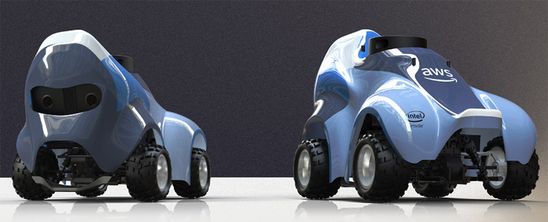
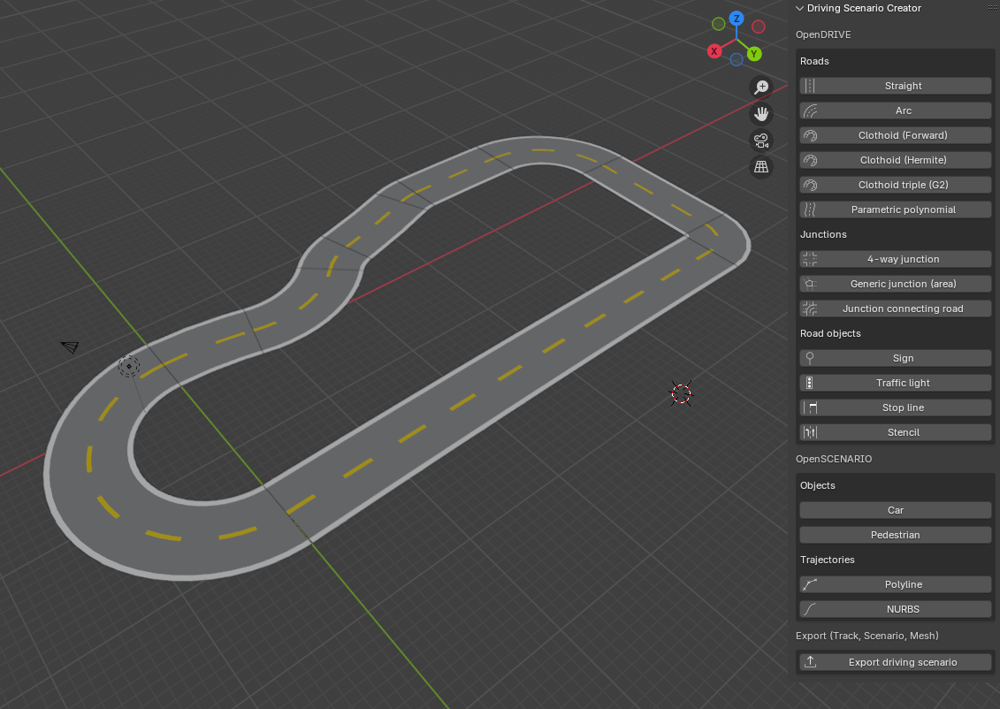
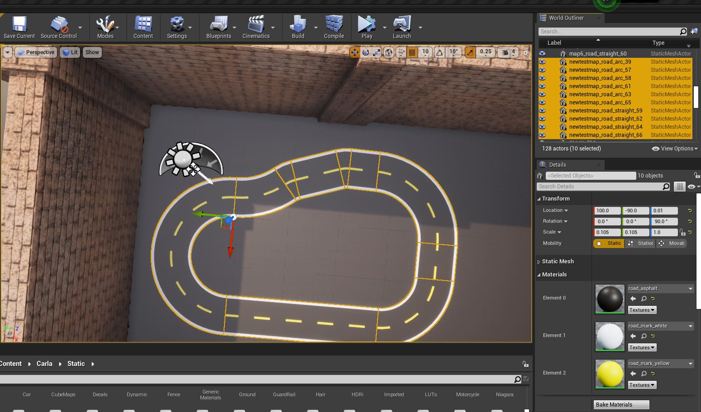
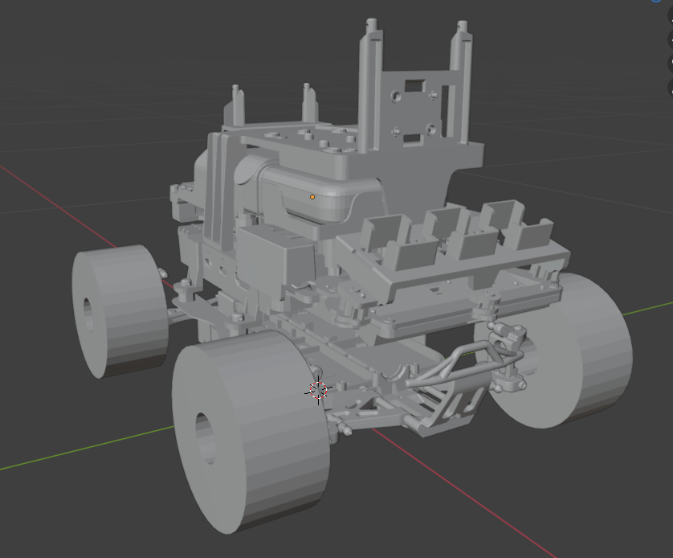

# Deepracer Carla Simulator wiki



**Welcome to the wiki!**

Here you will find step by step how to import and work with the AWS Deepracer in Carla Simulator (0.9.15 version).

# Quick Start:

### 1. Prerequisites and Dependencies Installation

To make the script and the simulator work, you need to prepare your environment with the following elements:

* Download the already compiled **CARLA package** which can be found on this [link](https://drive.google.com/file/d/1J0SOiZaXrFiA-FcyDWagMZQWEipHdKY9/view?usp=sharing).

* **Python Libraries:** Install the required graphical and calculation dependencies by running the following command:

```bash
  pip install pygame numpy matplotlib carla
```

Extract the CARLA package:

```bash
  tar -xvzf CARLA_0.9.15.2-2-gb23c01ae4-dirty.tar.gz
```

### 2. Launch the Map and Deepracer!

```bash
  cd CARLA_Shipping_0.9.15.2-2-gb23c01ae4-dirty/LinuxNoEditor
```
Launch the simulator: (Render off screen flag is used so that the window does not pop up)

```bash
  ./CarlaUE4.sh -RenderOffScreen
```
While the simulator is already running, you can launch the client. Use this [manual driving controler script](./sample_scripts/deepracer_manual_control.py) to test it out.

```bash
  python3 deepracer_manual_control.py
```
You will be able to drive the car using the WASD keys 

---

# Imitation learning

Here is a quick setup guide to start testing the Deepracer driving by itself!

* **Python Libraries:** Install the required graphical and calculation dependencies by running the following command:

```bash
   pip install opencv-python torch torchvision pillow
```
* **Environment settings** 

1) Download the .pth file on [this link](https://github.com/urjc-deepracer/sim-carla-il-deepracer/releases/tag/1.0.0)

2) Download these 3 files from [sample scripts](https://github.com/urjc-deepracer/docs/tree/main/docs/sample_scripts):

- [run_autopilot_demo.py code](./sample_scripts/run_autopilot_demo.py)

- [fancyvideocam.py code](./sample_scripts/fancyvideocam.py)

- [pilotnet.py code](./sample_scripts/utils/pilotnet.py)

3) All 4 downloaded files must be placed in the same directory 

**Run the autopilot** 

First, launch the simulator: (Render off screen flag is used so that the window does not pop up)

```bash
  ./CarlaUE4.sh -RenderOffScreen
```

**Example1**

- Autopilot onboard camera:
```bash
python3 run_autopilot_demo.py
```
**Example2**

- Top-down view code. Mode can be changed between trail (red trail that follows the Deepracer) and heatmap. Each camera belongs to a different track top view.
Cameras available from 1 to 5 and from 8 to 13.

```bash
python3 fancyvideocam.py --mode trail --cam 4
```

--- 

For further information, check the Imitation learning repository [here](https://github.com/urjc-deepracer/sim-carla-il-deepracer): https://github.com/urjc-deepracer/sim-carla-il-deepracer

---

### 📄 Each individual part documentation links

In case you want to explore or modify any part or asset, here are the links to the different tutorials. They explain the creation an implementation of the Deepracer and the creation and implementation of the Racetracks.

How to create the **racetracks** and import them:

- [Racetrack Creation](racetrackcreation.md)



- [Include Racetrack in a CARLA Map](includeracetrackcarla.md)




How the **Deepracer** was modeled and how to import it:

- [Create DeepRacer](createdeepracerinblender.md)



- [Import Deepracer to Carla](importdeepracercarla.md)

<iframe width="560" height="315" 
src="https://www.youtube.com/embed/6da4URc5QoI" 
frameborder="0" allowfullscreen></iframe>


How to use the *Carla client* to connect to the server:

- [Client Usage](clientusage.md)

How to **connect** a **remote** to drive the Deepracer (for testing or dataset generation)

- [Remote control Deepracer](remotecontrol.md)


---

In case you need help with the Unreal Engine 4 interface, here is a quick introduction guide:

## Introduction to Carla, Unreal Engine 4 Interface (Español)

<iframe width="560" height="315" 
src="https://www.youtube.com/embed/Vuz5f-t5mV4" 
frameborder="0" allowfullscreen></iframe>

