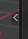
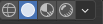
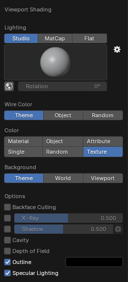
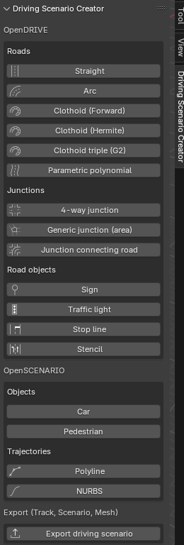
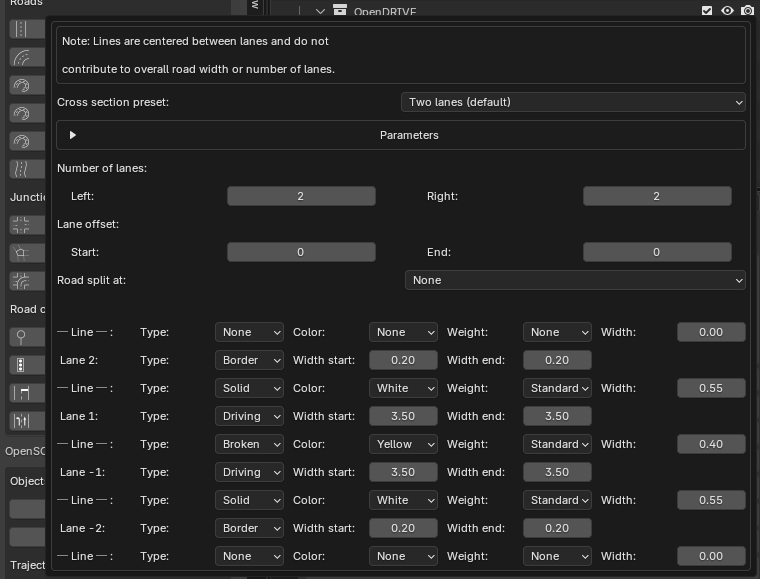
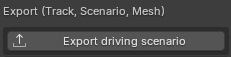
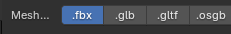
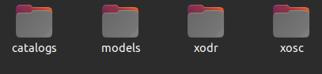

# How to Create the Racetrack

You will need to have **Blender** installed in your device, I use the 4.3.2 version (we are on February 2025).

[blender.org](https://www.blender.org/download/)

Now follow the steps from this repository.

(Notice there are both Windows and Linux implementations, only follow the Linux steps)

<a href="https://github.com/johschmitz/blender-driving-scenario-creator" target="_blank" style="font-weight:bold; color:#007acc; text-decoration:none;">
  GitHub - johschmitz/blender-driving-scenario-creator
</a>

To check if it is installed correctly and use this add-on in the correct way, just open Blender, press
N or click the little left arrow next to the navigation gizmo(Top right) to toggle the sidebar. 

Click View, set `Clip Start` to 1 m and `Clip End` to 10000 m to avoid some 3D viewport clipping issues since the Blender default setting is targeted more towards smaller models. 

Click the Shading dropdown button (the little down arrow in the top right corner of the 3D viewport)

And select `Texture` to be able to directly see the road sign textures.

Open the Driving Scenario Creator Sidebar:

Now it will be really easy to define the whole track, just click on whether you’d prefer to include in the track, either a straight road track, arc or clothoid…

Click on each one to be able to adjust their parameters:

Whenever you are selecting anything, just click ESC to ‘free your mouse’ from that mode, and you will be able to select a different one.

You will notice how all different road tracks align once you are displaying them and the mouse itself will be placed on the center of the next track piece.

Once you have your whole track done, for example:

Just click on Export driving Scenario, below the whole sidebar:

Now select the .fbx extension and export it in any directory you want.

This will generate these folders:

Notice that for Carla you will need the .fbx and the .xodr file. The .fbx file is located in /models/static_scene

And the .xodr file is in the /xodr folder

You can even check the OPENDrive file online to ensure it was created successfully:

[Online OpenDRIVE Viewer](https://odrviewer.io/)